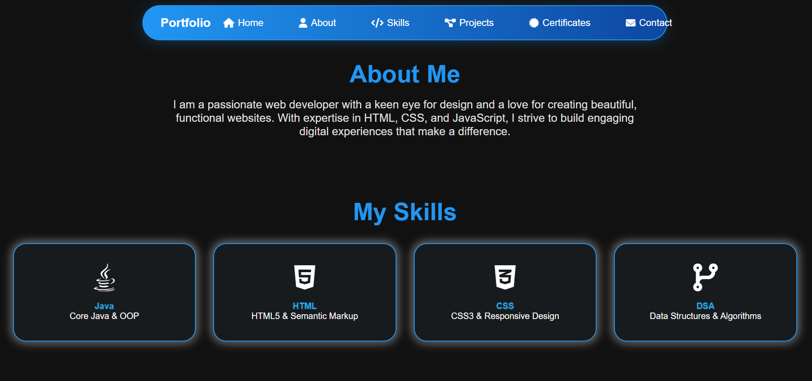
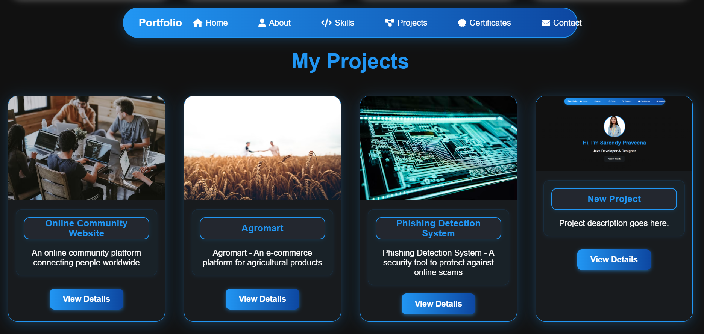

# 💼 Personal Portfolio Website

A responsive and stylish personal portfolio website built using **HTML** and **CSS** to showcase my skills, projects, and contact information.

---

## 🚀 Features

- Clean and responsive design
- About Me section
- Projects showcase with images and links
- Contact form (static or linked to email)
- Social media and GitHub/LinkedIn links
- Resume download (optional)

---

## 🛠️ Technologies Used

- HTML5
- CSS3
- (Optional: JavaScript for animations or interactivity)

---

## 🖼️ Screenshots

*Sample project showcase*

---

